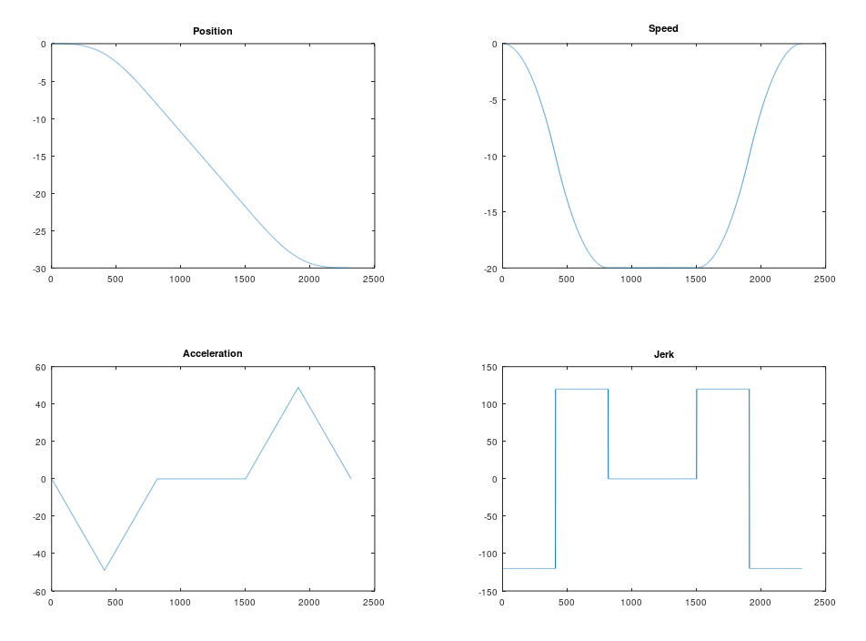

# DoubleSTrajectory
This easy to use and simple Matlab/Octave script generates a 7 segment trajectory which can be used to move something jerk free from A to B or generate a trajectory for a control algorithm. In my case it was used to generate cyclic positions for a servo motor.

Using `DoubleSTrajectoryFunction.m` requires the following parameters:
- T_s: cycle time of the trajectory
- q_0: starting position
- q_1: end position of the trajectory
- v_0: starting velocity
- v_1: velocity at the end of the trajectory
- v_max: maximum velocity
- v_min: minimum velocity (negative edge)
- a_max: maximum acceleration
- a_min: minimum acceleration (negative edge)
- j_max: maximum jerk
- j_min: minimum jerk (negative edge)

# Example
The easiest way to test this trajectory matlab function is to start the `DoubleSTrajectoryTest.m` file under Matlab or octave. This should generate the following output and return a trajectory with the following contrains:
- T_s: 0.001
- q_0: 0 mm
- q_1: -30 mm
- v_0: 0 mm/s
- v_1: 0 mm/s
- v_max: 20 mm/s
- v_min: -20 mm/s
- a_max: 60 mm/s²
- a_min: -60 mm/s²
- j_max: 120 mm/s³
- j_min: 120 mm/s³

# Author & Info
Matthias S. 
matthias [at] seehauser [dot] at 
https://www.seesle.at
MCI - Mechatronics
https://www.mci.at

# License
 KukaMatlabConnector von <a xmlns:cc="http://creativecommons.org/ns#" href="http://www.github.com/seehma/KMC" property="cc:attributionName" rel="cc:attributionURL">Matthias Seehauser</a> ist lizenziert unter einer <a rel="license" href="http://creativecommons.org/licenses/by-sa/4.0/">Creative Commons Namensnennung - Weitergabe unter gleichen Bedingungen 4.0 International Lizenz</a>. Beruht auf dem Werk unter <a xmlns:dct="http://purl.org/dc/terms/" href="https://www.github.com/seehma/KMC" rel="dct:source">https://www.github.com/seehma/KMC</a>.